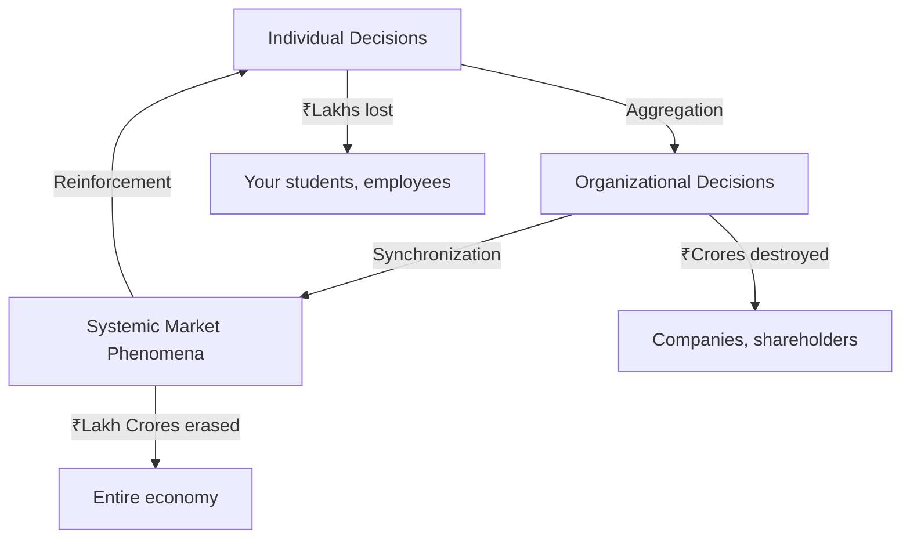

<div align="center">

# 🧠 Behavioral Finance Lecture Framework
### *From Homo Economicus to Homo Sapiens*

[](https://creativecommons.org/licenses/by-nc-sa/4.0/)
[](https://github.com)
[](https://github.com)
[](https://github.com)

**A comprehensive, experiential learning framework on cognitive biases in financial decision-making**  
*Designed for professor audiences, HR-OB professionals, and academic researchers*

[📚 Quick Start](#-quick-start) • [🎯 Learning Objectives](#-learning-objectives) • [📖 Full Content](#-table-of-contents) • [🎨 Visuals Guide](#-visual-resources) • [🤝 Contributing](#-contributing)

---

</div>

## 🌟 What Makes This Different?

<table>
<tr>
<td width="33%" align="center">

### 🎭 **Experiential**
Participants *experience* biases through live experiments, not just study them theoretically

</td>
<td width="33%" align="center">

### 🇮🇳 **Indian Context**
Real examples: Reliance Power IPO, SEBI data, NSE patterns, Sensex crashes

</td>
<td width="33%" align="center">

### 🎓 **Academic Rigor**
Grounded in Kahneman, Tversky, Thaler, and Ariely's research

</td>
</tr>
</table>

---

## 🚀 Quick Start

**For Workshop Facilitators:**
1. 📖 Read [`QUICK_REFERENCE.md`](QUICK_REFERENCE.md) for condensed teaching guide
2. 🎨 Review [`VISUAL_DIAGRAMS_GUIDE.md`](VISUAL_DIAGRAMS_GUIDE.md) to prepare graphics
3. 🎯 Run the fountain pen auction (anchoring bias demo)
4. 📊 Deliver the 40-minute lecture using this framework

**For Self-Study:**
- Start with the [Main README](README.md) for complete content
- Follow the [Six Core Biases](#-the-six-cognitive-biases) section
- Test yourself with real portfolio analysis

---

## 📋 Table of Contents

<details>
<summary><b>Click to expand complete navigation</b></summary>

### Part I: Theoretical Foundations (20 min)
- [Classical Finance Theory](#1-classical-finance-theory-the-rational-foundation-5-min)
  - Efficient Market Hypothesis
  - Rational Actor Model  
  - Expected Utility Theory
- [The Behavioral Revolution](#2-the-behavioral-revolution-10-min)
  - Kahneman & Tversky: Prospect Theory
  - Richard Thaler: Mental Accounting
  - Dan Ariely: Predictable Irrationality
- [The OB-HR Bridge](#3-your-ob-hr-bridge-5-min)

### Part II: Core Biases Taxonomy (15 min)
- [Bias 1: Anchoring](#bias-1-anchoring)
- [Bias 2: Confirmation Bias](#bias-2-confirmation-bias)
- [Bias 3: Overconfidence](#bias-3-overconfidence)
- [Bias 4: Loss Aversion](#bias-4-loss-aversion-disposition-effect)
- [Bias 5: Herd Behavior](#bias-5-herd-behavior)
- [Bias 6: Recency Bias](#bias-6-recency-bias)

### Applications & Resources
- [Synthesis Framework](#synthesis-the-bias-interaction-web)
- [Visual Diagrams Guide](VISUAL_DIAGRAMS_GUIDE.md)
- [References & Citations](#references--further-reading)

</details>

---

## 🎯 Learning Objectives

By the end of this lecture, participants will be able to:

```
✓ Trace the evolution from classical finance theory to behavioral finance
✓ Explain Prospect Theory's four revolutionary insights  
✓ Identify six core cognitive biases in their own financial decisions
✓ Analyze how biases compound to create systematic market inefficiencies
✓ Apply behavioral insights to HR choice architecture
```

---

## 💡 The Six Cognitive Biases

<table>
<tr>
<th width="20%">Bias</th>
<th width="30%">What It Is</th>
<th width="25%">Financial Impact</th>
<th width="25%">Indian Example</th>
</tr>

<tr>
<td><b>⚓ Anchoring</b></td>
<td>First number sticks, contaminating all future valuations</td>
<td>IPO pricing, 52-week highs become false reference points</td>
<td>Reliance Power: ₹450 IPO → ₹25 today (15-year wait for "return")</td>
</tr>

<tr>
<td><b>✓ Confirmation</b></td>
<td>Seeking only information that confirms existing beliefs</td>
<td>Holding losers, ignoring contrary evidence</td>
<td>"My infrastructure fund will bounce back" (ignores debt crisis)</td>
</tr>

<tr>
<td><b>💪 Overconfidence</b></td>
<td>Systematic overestimation of one's abilities</td>
<td>Excessive trading, under-diversification</td>
<td>SEBI 2023: 89% of day traders lost money (avg ₹1.1L loss)</td>
</tr>

<tr>
<td><b>😰 Loss Aversion</b></td>
<td>Losses hurt ~2.5× more than equivalent gains feel good</td>
<td>Disposition effect: sell winners early, hold losers forever</td>
<td>NSE data: 24% annual wealth destruction from holding losers</td>
</tr>

<tr>
<td><b>👥 Herd Behavior</b></td>
<td>Following the crowd without independent analysis</td>
<td>Market bubbles and crashes</td>
<td>2017 crypto: ₹4.5L → ₹14L → ₹2.5L (70% losses for late entrants)</td>
</tr>

<tr>
<td><b>📅 Recency Bias</b></td>
<td>Recent trends assumed to continue indefinitely</td>
<td>Performance chasing, buying at peaks</td>
<td>AMFI: ₹18K cr into thematic funds AFTER rally peaked</td>
</tr>
</table>

---

## 🧪 Core Framework: Prospect Theory

<div align="center">

### **The Four Revolutionary Insights**

</div>

| Insight | Explanation | Example |
|---------|-------------|---------|
| **Reference Point Dependency** | We evaluate as gains/losses from a reference, not absolute wealth | Losing ₹1000 from wallet ≠ Missing ₹1000 discount (same ₹1000!) |
| **Loss Aversion** | Losses hurt 2-2.5× more than equivalent gains feel good | Coin flip: Win ₹15K or lose ₹10K? Most reject (+EV = ₹2.5K) |
| **Diminishing Sensitivity** | ₹0→₹100 feels better than ₹900→₹1000 | Salary raise: ₹5K matters more at ₹30K than ₹90K base |
| **Probability Weighting** | We overweight small probabilities, underweight large ones | Buy lottery tickets AND insurance (contradictory risk attitudes) |

---

## 📊 The Three Levels of Impact



<table>
<tr>
<th>Level</th>
<th>What Happens</th>
<th>Examples</th>
<th>Your Role</th>
</tr>

<tr>
<td><b>🧍 Individual</b></td>
<td>Suboptimal returns, wealth erosion</td>
<td>Holding Vodafone Idea ₹50→₹5</td>
<td>Educator, debiaser</td>
</tr>

<tr>
<td><b>🏢 Organizational</b></td>
<td>Failed M&A, sunk cost projects</td>
<td>Kingfisher Airlines sunk cost trap</td>
<td>Choice architect</td>
</tr>

<tr>
<td><b>🌍 Systemic</b></td>
<td>Bubbles, crashes, misallocation</td>
<td>2008 GFC, dotcom bubble</td>
<td>Policy influencer</td>
</tr>
</table>

---

## 🎨 Visual Resources

We've created detailed specifications for **10 professional diagrams**:

<table>
<tr>
<td align="center" width="20%">

### 📈
**Prospect Theory**  
S-curve value function

</td>
<td align="center" width="20%">

### 📅
**Timeline**  
1944 → 2024 evolution

</td>
<td align="center" width="20%">

### 🕸️
**Bias Web**  
Interaction network

</td>
<td align="center" width="20%">

### 📊
**Market Chart**  
Sensex with annotations

</td>
<td align="center" width="20%">

### 🎯
**Choice Architecture**  
Ethical design matrix

</td>
</tr>
</table>

👉 **[Complete Visual Diagrams Guide](VISUAL_DIAGRAMS_GUIDE.md)**

Each includes:
- ✅ Design specifications (colors, dimensions, layout)
- ✅ Implementation guides (PowerPoint, Python, Excel)
- ✅ Teaching moments (what to say when presenting)
- ✅ Animation sequences for digital presentations

---

## 🛠️ Implementation Guide

### Workshop Structure (40 minutes)

```
┌─────────────────────────────────────────────────────────┐
│  00:00 - 02:00  │ Opening hook + auction results       │
│  02:00 - 07:00  │ Classical finance theory             │
│  07:00 - 17:00  │ Behavioral revolution                │
│  17:00 - 22:00  │ OB-HR bridge                         │
│  22:00 - 37:00  │ Six biases (2.5 min each)            │
│  37:00 - 39:00  │ Synthesis framework                  │
│  39:00 - 40:00  │ Closing + transition                 │
└─────────────────────────────────────────────────────────┘
```

### Required Materials

- [ ] Fountain pens for auction (premium quality, ₹200-300 actual value)
- [ ] Bilingual data collection sheets (Hindi-English)
- [ ] Presentation slides (see Visual Guide)
- [ ] Handout: Bias quick reference table
- [ ] Participant portfolios (optional, for homework)

### Audience Engagement Strategy

**Hand-raise moments:** After each bias presentation
- Expected: 60-80% participation on at least 3 biases
- Purpose: Create safe confession space, normalize susceptibility
- Follow-up: Brief silence to let self-recognition sink in

---

## 📚 Academic Foundation

### Core Citations

| Author(s) | Year | Contribution | Impact |
|-----------|------|--------------|---------|
| **Kahneman & Tversky** | 1979 | Prospect Theory | Nobel Prize 2002 |
| **Thaler** | 1980s | Mental Accounting, Endowment Effect | Nobel Prize 2017 |
| **Ariely et al.** | 2003 | Coherent Arbitrariness (Anchoring) | QJE publication |
| **Barber & Odean** | 2000 | Individual investor underperformance | 3-4% annual cost |
| **SEBI** | 2023 | Indian trader profitability study | 89% lose money |

### Recommended Reading

<details>
<summary><b>Foundational Books</b></summary>

1. **Thinking, Fast and Slow** - Daniel Kahneman (2011)
   - Comprehensive overview of System 1 vs System 2 thinking
   - Essential for understanding dual-process theory

2. **Predictably Irrational** - Dan Ariely (2008)
   - Accessible experiments demonstrating systematic biases
   - Great for teaching examples

3. **Nudge** - Thaler & Sunstein (2008)
   - Choice architecture and libertarian paternalism
   - Directly applicable to HR-OB design

4. **Irrational Exuberance** - Robert Shiller (2000)
   - Market bubbles and social contagion
   - Historical perspective on herd behavior

</details>

<details>
<summary><b>Key Research Papers</b></summary>

1. Kahneman, D., & Tversky, A. (1979). "Prospect Theory: An Analysis of Decision under Risk." *Econometrica*, 47(2), 263-291.

2. Thaler, R. H. (1985). "Mental Accounting and Consumer Choice." *Marketing Science*, 4(3), 199-214.

3. Barber, B. M., & Odean, T. (2000). "Trading Is Hazardous to Your Wealth." *The Journal of Finance*, 55(2), 773-806.

4. Shiller, R. J. (1981). "Do Stock Prices Move Too Much to be Justified by Subsequent Changes in Dividends?" *American Economic Review*, 71(3), 421-436.

</details>

---

## 💼 For HR-OB Professionals

### Where These Biases Show Up in Your Work

<table>
<tr>
<th width="30%">HR Function</th>
<th width="35%">Bias Manifestation</th>
<th width="35%">Design Solution</th>
</tr>

<tr>
<td><b>Retirement Planning</b></td>
<td>Status quo bias → Never change default allocation</td>
<td>✅ Smart defaults: Age-based auto-allocation</td>
</tr>

<tr>
<td><b>Performance Reviews</b></td>
<td>Recency bias → Last 2 months dominate annual review</td>
<td>✅ Quarterly check-ins + structured rating system</td>
</tr>

<tr>
<td><b>Compensation Design</b></td>
<td>Mental accounting → Salary ≠ Bonus (same money!)</td>
<td>✅ Total comp statements showing full picture</td>
</tr>

<tr>
<td><b>Benefits Selection</b></td>
<td>Choice overload → 401k with 59 options = paralysis</td>
<td>✅ Curated set: 5 options + 1 default target-date fund</td>
</tr>

<tr>
<td><b>Change Management</b></td>
<td>Loss aversion → Resistance to new systems</td>
<td>✅ Frame as avoiding future losses, not current change</td>
</tr>
</table>

> **Your Role:** You design the choice architecture. Every form, every default, every enrollment process either exploits or mitigates these biases. Choose wisely.

---

## 🎓 Teaching Tips & Best Practices

### ✅ Do This

- **Start with confession:** Share YOUR bias story first (normalizes vulnerability)
- **Use silence strategically:** After hand-raises, pause 3-5 seconds
- **Respect expertise:** "Even Nobel Prize winners fall for these" (reduces defensiveness)
- **End with hope:** "Awareness is 50% of the solution"
- **Connect to status:** Use academic citations heavily (builds credibility)

### ❌ Avoid This

- Don't use judgment language ("People make this mistake")
- Don't skip the hand-raise moments (that's where learning happens)
- Don't rush through examples to save time
- Don't assume participants know the research (explain context)
- Don't make it feel like a "gotcha" exercise

### 🎯 Engagement Calibration

Expected hand-raise response rates:
- **Anchoring:** 60-70%
- **Confirmation:** 70-80%
- **Overconfidence:** 50-60% (ego protection)
- **Loss Aversion:** 80-90% (nearly universal)
- **Herd Behavior:** 60-70%
- **Recency Bias:** 70-80%

If rates are lower → Create safer space, share more personal examples

---

## 🌍 Cultural Adaptations

### For Indian Contexts (Current Version)

- ✅ INR currency throughout
- ✅ NSE, BSE, Sensex references
- ✅ Indian regulatory bodies (SEBI, RBI)
- ✅ Local examples (Reliance Power, Yes Bank, Vodafone Idea)
- ✅ EPF, NPS, PPF terminology

### For Other Contexts

<details>
<summary><b>Adapting for International Audiences</b></summary>

**Replace:**
- Currency: INR → Local currency
- Markets: Sensex → Local index (S&P 500, FTSE, etc.)
- Companies: Use local corporate scandals and IPOs
- Regulations: SEBI → Local equivalent (SEC, FCA, etc.)
- Retirement: EPF/NPS → 401k/Superannuation/Pension schemes

**Keep:**
- Core theory (universal)
- Research citations (globally recognized)
- Bias taxonomy (applies everywhere)
- Choice architecture principles (context-independent)

</details>

---

## 🤝 Contributing

We welcome contributions, especially:

### 📝 Content Improvements
- Additional Indian market examples
- Updated regulatory data (SEBI reports)
- New research citations
- Translation to regional languages

### 🎨 Visual Enhancements
- Actual diagram files (PNG, SVG)
- PowerPoint templates
- Interactive web visualizations
- Video lecture recordings

### 🔧 Tools & Resources
- Data analysis scripts (Python, R)
- Portfolio analysis templates
- Assessment rubrics
- Student worksheets

### How to Contribute

1. **Fork this repository**
2. **Create a feature branch:** `git checkout -b feature/your-improvement`
3. **Commit your changes:** `git commit -m 'Add: new bias example'`
4. **Push to branch:** `git push origin feature/your-improvement`
5. **Submit a Pull Request**

---

## 📜 License

<div align="center">

[](https://creativecommons.org/licenses/by-nc-sa/4.0/)

**Creative Commons Attribution-NonCommercial-ShareAlike 4.0 International**

</div>

**You are free to:**
- ✅ Share — copy and redistribute the material
- ✅ Adapt — remix, transform, and build upon the material

**Under these terms:**
- **Attribution** — Credit original author (RK)
- **NonCommercial** — Not for commercial purposes
- **ShareAlike** — Distribute adaptations under same license

---

## 📬 Contact & Support

<div align="center">

### Questions? Feedback? Collaboration?

**For Academic Queries:** Create an issue in this repository  
**For Workshop Bookings:** [Contact via LinkedIn/Email]  
**For Customization:** Fork and adapt freely (within license terms)

---

### ⭐ If this resource helped you, please star this repository!

It helps other educators discover this framework.

---

**Built with ❤️ for educators by educators**  
*Based on research by Kahneman, Tversky, Thaler, and Ariely*

**Last Updated:** January 2026  
**Version:** 1.0

</div>

---

## 🗺️ Roadmap

### Current Version (v1.0)
- [x] Complete lecture framework
- [x] Six bias taxonomy
- [x] Visual diagrams guide
- [x] Teaching best practices
- [x] Indian market examples

### Planned Features (v1.1)
- [ ] Actual slide deck (PowerPoint/Google Slides)
- [ ] Video lecture recording
- [ ] Student assessment rubric
- [ ] Portfolio analysis worksheet
- [ ] Debiasing strategies section

### Future Enhancements (v2.0)
- [ ] Interactive web version
- [ ] Multi-language support (Hindi, Tamil, etc.)
- [ ] Advanced topics (neuroeconomics, market microstructure)
- [ ] Industry-specific adaptations (banking, insurance, fintech)

---

<div align="center">

**🙏 Acknowledgments**

This framework stands on the shoulders of giants:
- Daniel Kahneman & Amos Tversky (Prospect Theory)
- Richard Thaler (Mental Accounting, Nudge Theory)  
- Dan Ariely (Predictable Irrationality)
- Robert Shiller (Irrational Exuberance)

And countless educators who've refined behavioral economics pedagogy.

</div>
